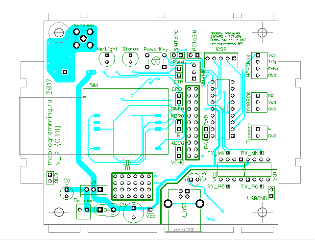
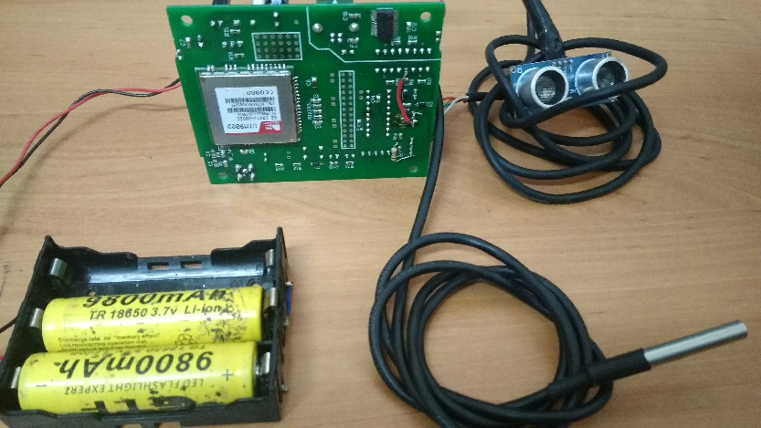
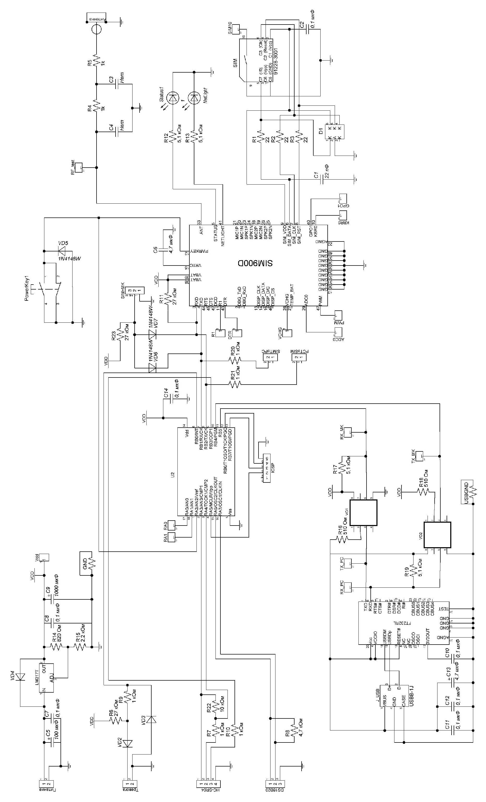

# Описание устройства

**_Автономный измеритель уровня воды на основе ультразвукового датчика и GSM-модуля SIM900_**

Устройство содержит GSM-модуль SIM900D с сим-картой, микроконтроллер PIC16F628, ультразвуковой датчик НC-SR04, датчик температуры DS18B20 и контакты на размыкание для подачи сигнала о взломе. Передача информации и связь оператора с устройством осуществляется через GSM – модуль.

## 📌 Дополнительные разделы

-   [Протокол обмена данными через COM-порт](<docs/protocol(COM-port).md>)
-   [Основные команды управления устройством](docs/commands.md)
-   [Список комплектующих](docs/components.md)
-   [Основной код](src/GSM.asm)

Устройство устанавливается на определенной высоте над водой и фиксируется. В качестве опоры для установки устройства может быть использована тренога с горизонтальным штоком для крепления устройства. Как видно из таблицы сообщения «SetThisNumber», «T», «R» являются командой запроса данных с датчиков. По событию приема данных команд выполняются подпрограммы работы с ультразвуковым датчиком расстояния HC-SR04 и датчиком DS18B20.

Алгоритм работы устройства заключается в следующем: пользователь отправляет СМС со своего телефона с кодовыми словами на номер устройства, а в ответ приходит СМС со значением температуры и расстояния до поверхности воды. При этом номер телефона, с которого было отправлено СМС с кодовыми словами, сохраняется в энергонезависимой памяти микроконтроллера. И на этот номер телефона в последующем устройство будет отправлять данные по СМС-запросу. Данные с устройства также отправляются в виде СМС. В случае если поступит запрос на номер сим-карты устройства о передаче данных с другого номера, ответное СМС будет отправлено на первоначально зарегистрированный номер телефона. Для смены номера телефона пользователю достаточно отправить СМС с кодовыми словами с соответствующего телефона, тогда в памяти микроконтроллера будет сохранен новый номер телефона.
Далее через сотовый телефон пользователь вводит в память устройства начальное расстояние (высота): это может быть критический уровень воды (высота) во время наводнения в месте установки устройства или начальное расстояние устройства над водой. Если не вводить начального расстояния, то устройство будет посылать расстояние от устройства до поверхности воды.

### 🖼️ Печатная плата

Главной особенностью данного проекта является его минимальное потребление за счет перехода всех модулей кроме МК в режим сна. Модуль SIM900 переходит в спящий режим автоматически через 15 секунд после отсутствия связи с МК (ток потребления модуля в этом режиме порядка 1 мА).

МК не переходит в спящий режим совсем, так как иначе он не сможет принимать сообщения от SIM900D без потерь (ток потребления МК порядка 8 мА).

Ток потребления составляет 6-8 мА

В качестве питания используются стандартные 9-Вольтовые или 12-Вольтовые батареи или аккумуляторы.

### Устройство

#### 🖼️ Схема устройства

